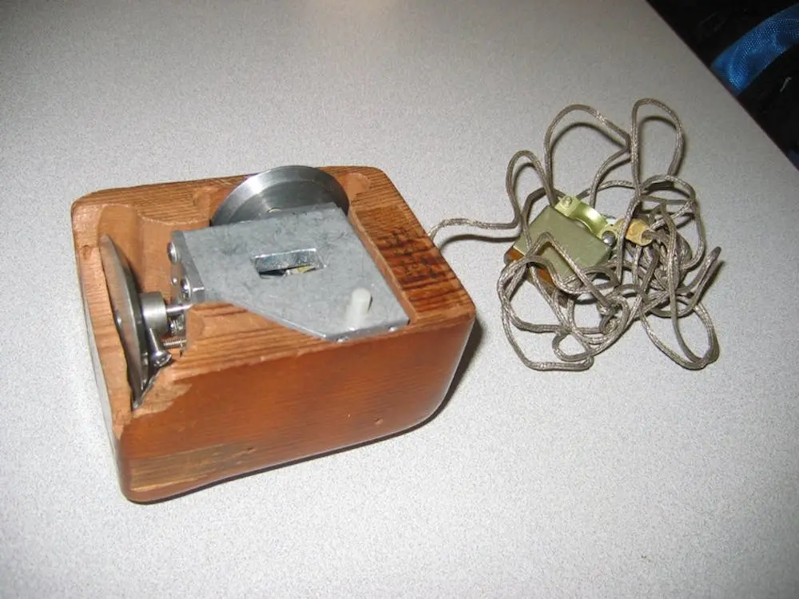
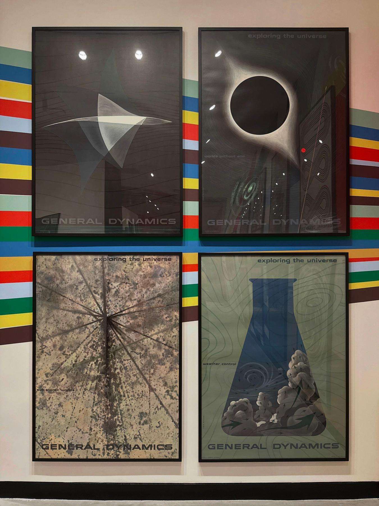

## 1. sisters-and-derek-jarman-1024x724.jpg

- **Board:** todraw (`todraw`)
- **Type:** image
- **Are.na:** https://www.are.na/block/11043327

---

## 2. kp3pcmgy-1372998436.jpg?ixlib=rb-1.1.0-q=45-auto=format-w=1000-fit=clip

- **Board:** cybernetics (`cybernetics-qvg3mlbadyu`)
- **Type:** image
- **Are.na:** https://www.are.na/block/23332195

---

## 3. (untitled)

- **Board:** stubborn fragments (`stubborn-fragments`)
- **Type:** text
- **Are.na:** https://www.are.na/block/35571361

The Database is indifferent to truth

---

## 4. The Visual Language of the Nuclear Age

- **Board:** nuclear history (`nuclear-history`)
- **Type:** image
- **Are.na:** https://www.are.na/block/38733487

---
